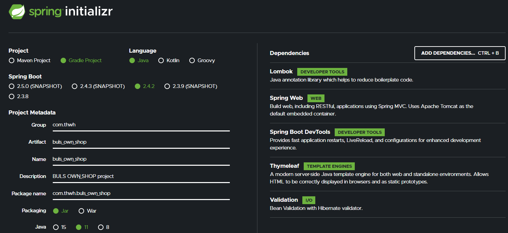

# BULS_OWN SHOP

online baseball shop

### [BULS_OWN SHOP Wiki](https://github.com/shinwonse/BULS_OWN-SHOP/wiki)

<!-- ### 스프링 기본 설정
 -->

## Home

    쇼핑몰 메인 페이지이다. 상단의 메뉴바는 어느 페이지로 이동하든 항상 표시된다. 'BULS_OWN-SHOP' 로고를 클릭하면 메인 페이지로 이동되며, 서브 링크는 'Home', 'Glove', 'Bat', 'Spike'로 이루어져 있다. 링크를 클릭시 각각의 페이지로 연결된다. '로그인 상태'가 아니라면 'Register'와 'Sign in'이 표시되고, '로그인 상태'라면 'Logout', 'My Page'가 표시된다.

    중앙의 사진은 총 3가지의 슬라이드로 구성되어 있으며, 일정 시간이 지나면 자동으로 다음 사진으로 이동한다. 사용자가 직접 사진을 넘길 수도 있다.

    하단의 footer 또한 어느 페이지로 이동하든 항상 표시되며, 연락처와 이메일이 적혀있고, 깃허브, 유튜브, 인스타그램으로 이동할 수 있는 링크가 있다.

## Register

    웹 사용자가 '로그인 상태'가 아니라면 'Register' 버튼을 누를 수 있다. 사용자는 필요한 정보를 입력 후 회원가입을 진행할 수 있다.

## Login

## Product List

## Product Buy

## Order Page

## My Page

## Admin Main

## Create Product

## Product List

## Member List

